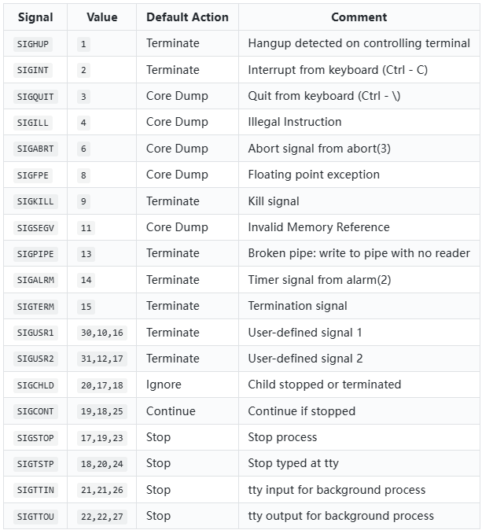

1. Signals

    A signal is a notification(说明) to a process that an event has occurred. Signals are sometimes described as software interrupts, analogous(相似) to hardware interrupts in that they interrupt the normal flow(流) of execution of a program.

    The following are a list of standard `POSIX` signals. Note that `Core Dump` can be thought of as Terminate abnormaly.

    `Core Dump`: 
    core的意思是：内存，dump的意思是：扔出来、堆出来。
    开发和使用linux程序时，有时程序莫名其妙的down掉了，却没有任何的提示(有时候会提示core dumped)。
    这时候可以查看一下有没有形如：core 的文件生成，这个文件便是操作系统把程序down掉时的内存的内容扔出来生成的，它可以做为调试程序的参考。
    core dump又叫核心转储，当程序运行过程中发生异常，程序异常退出时，由操作系统把程序当前的内存状况存储在一个core文件中，叫core dump。

    

